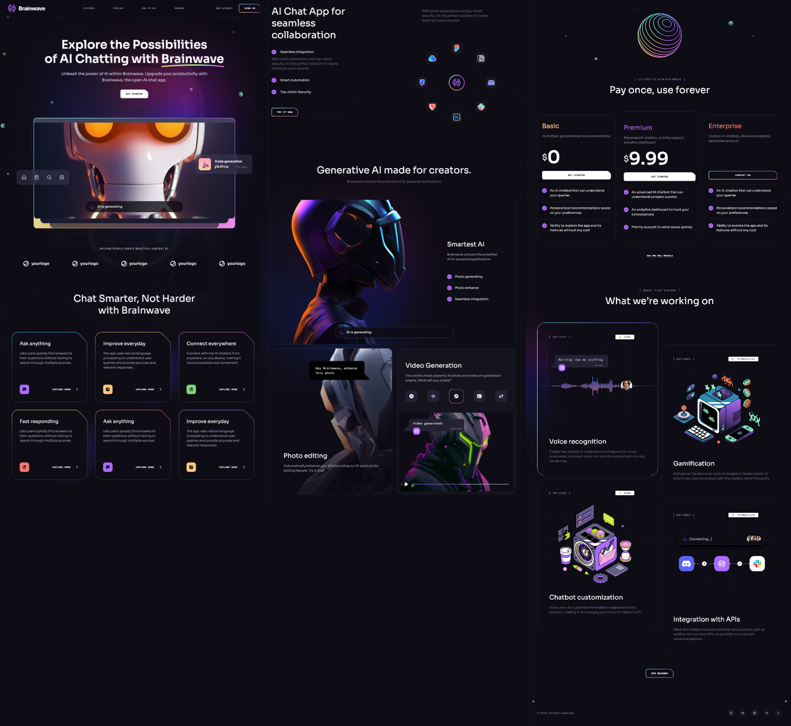

<div align="center">

# Brainwave - AI Chat UI/UX

Brainwave is a modern and responsive **UI/UX for an AI-powered chat platform**, built with **React, Vite, and TailwindCSS**. This project provides an elegant frontend design for AI-driven conversations, collaboration, and interactive features.

</div>

---

<div align="center">

### 🛠 Built With

[](https://react.dev/)
[](https://vitejs.dev/)
[](https://tailwindcss.com/)
[](https://www.npmjs.com/package/react-just-parallax)

</div>

---

## 🧠 Overview

**Brainwave** is a beautifully designed UI for an AI chat platform. It showcases modern React components, smooth parallax effects, and a fully responsive layout, built to demonstrate AI-powered collaboration interfaces.

---

## 📸 Demo



---

## 🚀 Features

- 💬 Responsive and sleek **chat interface**
- 🤖 AI-powered **UI components** for seamless interaction
- 🎨 Designed using **TailwindCSS** for modern styling
- ⚡ Built with **Vite** for fast development and optimized performance
- 🧩 Includes **buttons, chat bubbles, pricing sections, and more**

---

## 📦 Project Structure

```bash
brainwave/
├── public/             # Static assets
├── src/
│   ├── assets/         # Images, SVGs, and static resources
│   ├── components/     # React components (Header, Hero, Footer, etc.)
│   │   ├── design/     # Specialized design elements (backgrounds, effects)
│   ├── constants/      # Static data and configuration
│   ├── App.jsx         # Root App component
│   ├── index.css       # Global styles
│   ├── main.jsx        # Entry point for React
│   └── README.md       # Project documentation
├── package.json        # Project metadata and dependencies
├── .gitignore          # Git ignore rules
├── vite.config.js      # Vite configuration
└── README.md           # Main README file
```

---

## 🛠️ Technologies Used

- **React** – Frontend framework
  **react-just-parallax** – For smooth parallax scrolling effects
- **Vite** – Fast build tool
- **TailwindCSS** – Styling
- **React Router** – For navigation

---

## 📦 Installation & Setup

1. **Clone the repository:**

   ```sh
   git clone https://github.com/Oran01/brainwave.git
   cd brainwave
   ```

2. **Install dependencies:**

   ```sh
   npm install
   ```

3. **Start the development server:**

   ```sh
   npm run dev
   ```

4. Open [http://localhost:5173] (<http://localhost:5173>) in your browser.

---

## 📺 Based on JavaScript Mastery

This project was built following the **JavaScript Mastery** tutorial:
🔗 [YouTube Video](https://www.youtube.com/watch?v=RbxHZwFtRT4&t=14266s)

---

## 🤝 Contributing

Feel free to fork this repository and submit pull requests to improve the project!

---

⭐ If you enjoyed this project, please consider giving it a star ⭐
